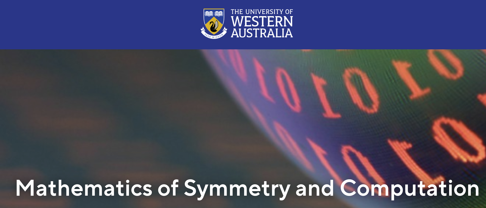
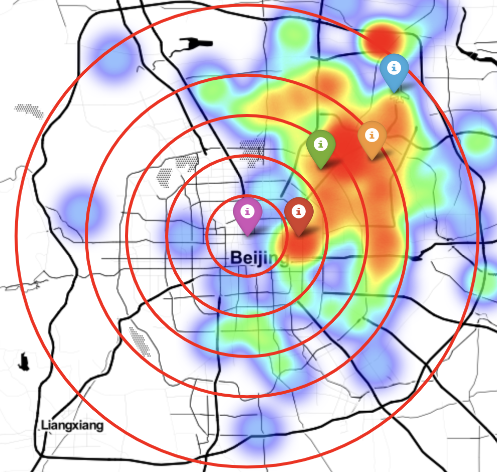

# Agent-Based Modeling of Demographic Changes in Urbanization

## Abstract
In this research, we employ an agent-based modeling approach to simulate the demographic changes in modern urbanization in China. The model aims to understand the evolution of urban systems and patterns of demographic change, shedding light on the theory of urban change. We propose that emerging cities experience a large influx of population into the city center initially, followed by a portion of the population outflow after reaching population saturation. The model demonstrates that the distribution of population after reaching equilibrium is similar to the existing map of urban construction. Additionally, the model reveals that the urbanization process leads to a widening gap between the rich and the poor, highlighting the socio-economic implications of urban development.

## Introduction
China has witnessed rapid urbanization in the past two decades, transforming many cities into cosmopolitan centers. However, this urban growth has also brought challenges such as high housing prices and ecological damage, impacting the well-being of ordinary people. Understanding the dynamics of urban systems and population changes in the urbanization process is essential. 

This research employs agent-based modeling, a valuable tool in social science research, to investigate the relationship between urban systems, population, and population mobility in China's urban changes. The model is based on the concept of urban evolution and incorporates factors such as residents' wealth, income, consumption, fertility, and mortality. The model also considers the influence of the surrounding environment and government policies.

## Statistics
The model's output provides statistical insights into the simulated urbanization process. Key findings include:

### Population:
- The initial numbers are small and the locations are scattered.
- 

- The population initially grows and moves towards the city center. Eventually, the population spreads outward and reaches an equilibrium state.
- 

#### _~~Balance~~_ State:

- 

#### Beijing Map:

- 
- 

### Average Wealth:
- The average wealth of residents in the downtown area increases significantly during urbanization. As people move away from the city center, the average wealth decreases, reflecting a shift in wealth distribution. Region 3 experiences a significant increase and later converges with other regions.
- Similarity to Beijing Map: The final distribution of residents in the model closely resembles the urban construction and population distribution observed in Beijing in 2022.

- 
- Gap between the Rich and the Poor: The model demonstrates an increasing gap between the rich and the poor during the urban development process. The wealthy residents become wealthier, while the poorest residents experience declining wealth.

- According to the graph below, the rich in region 4 are far richer than the rest of the population. The rapid decline of
the latter line is due to the death of the rich.
### Highest Wealth
- 

### Lowest Wealth
- 

## Conclusion
- The agent-based modeling approach provides valuable insights into the demographic changes in urbanization in China. The model demonstrates the trajectory of population movement, the similarity between the simulated distribution and real-world urban construction, and the widening gap between the rich and the poor during urban development.

- Future work can expand the model to incorporate ecosystem dynamics, the influence of government policies, and the inheritance of property. These additions would further enhance the model's realism and provide a more comprehensive understanding of the urbanization process and its impact on population dynamics.
